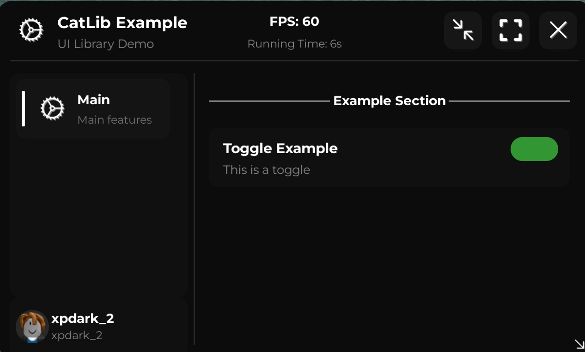
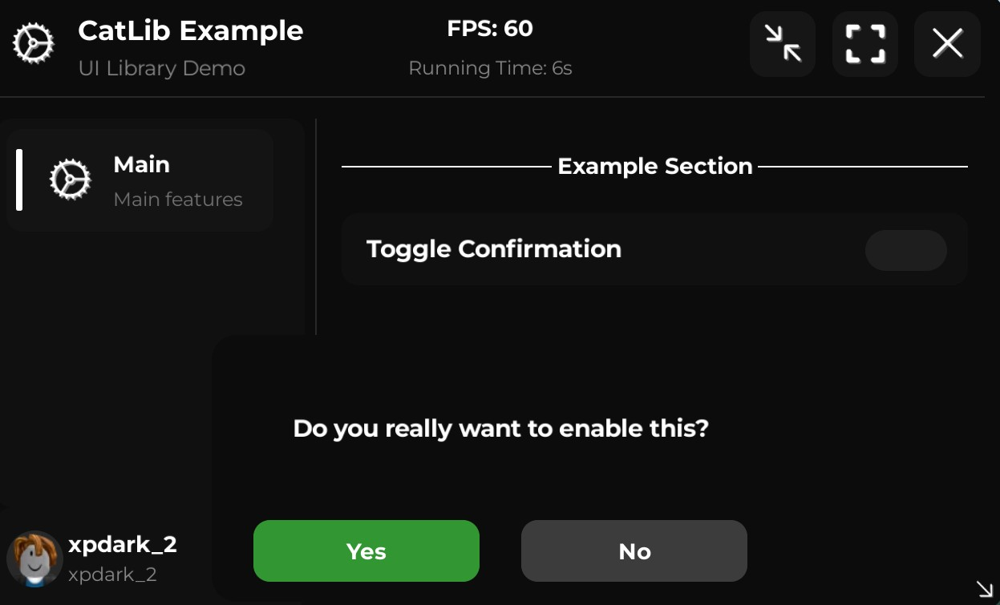
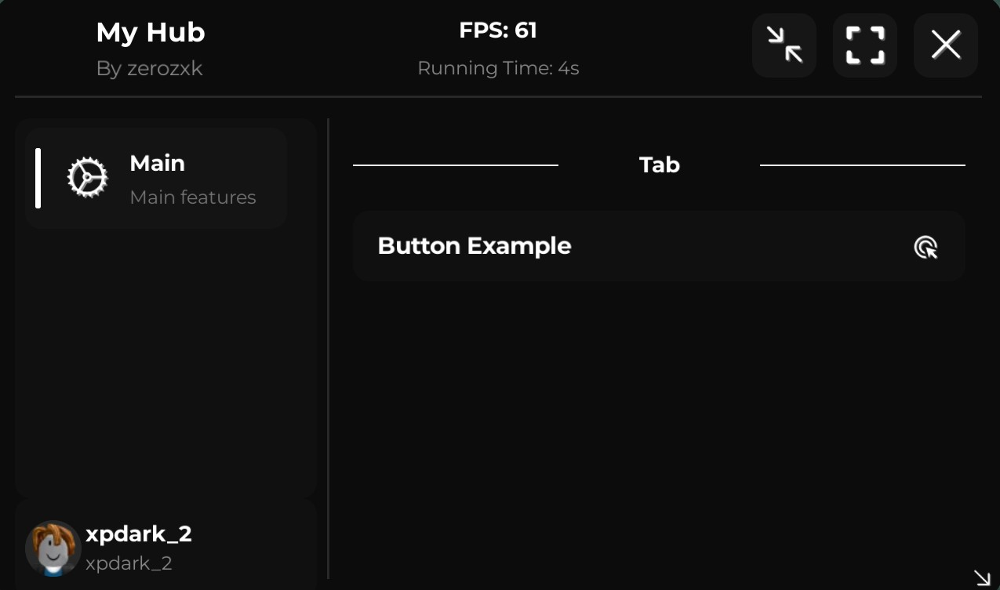
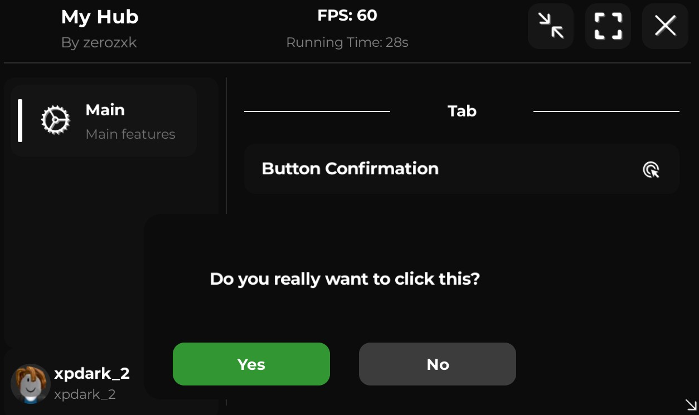
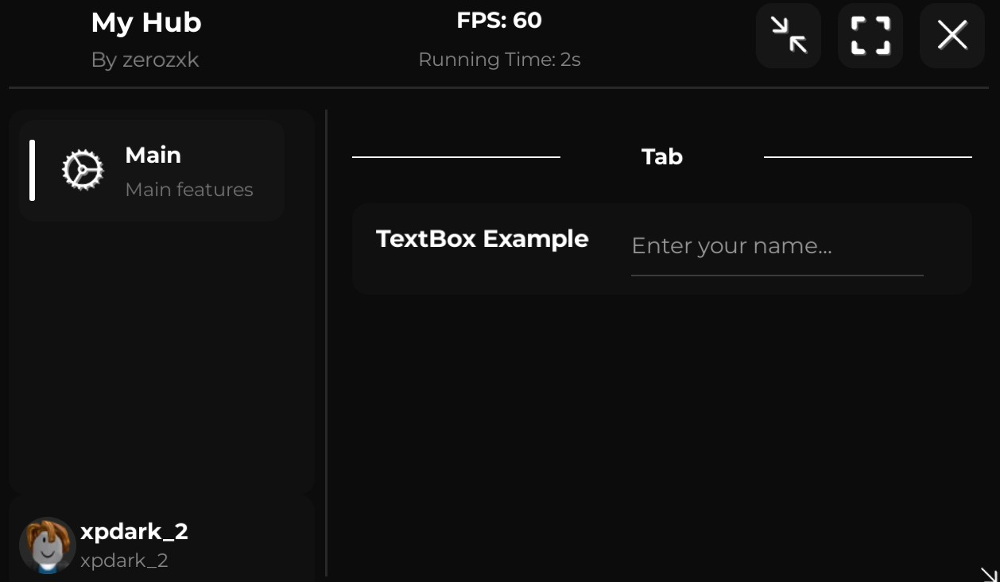
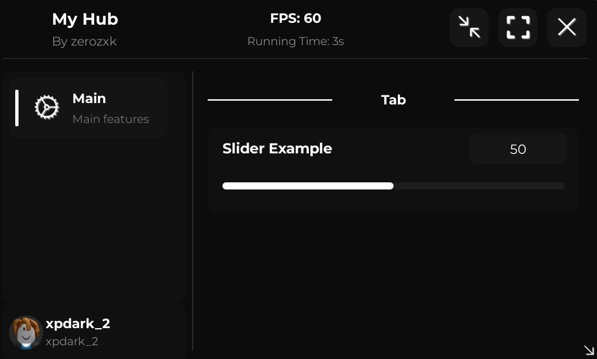
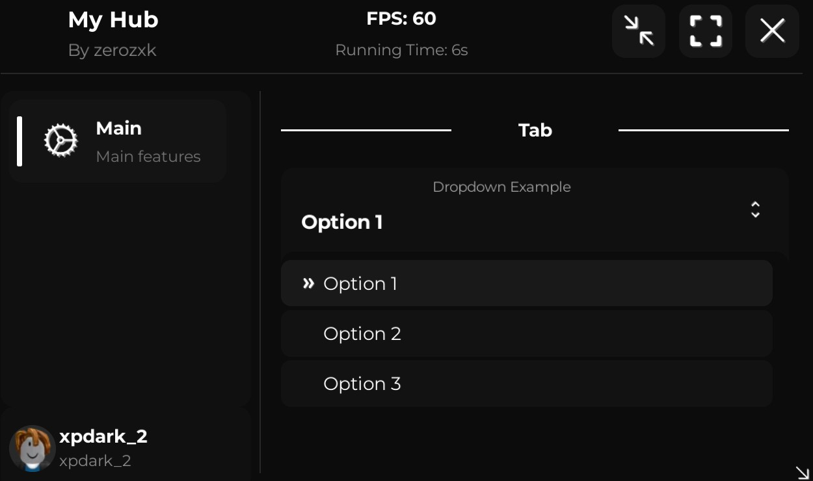
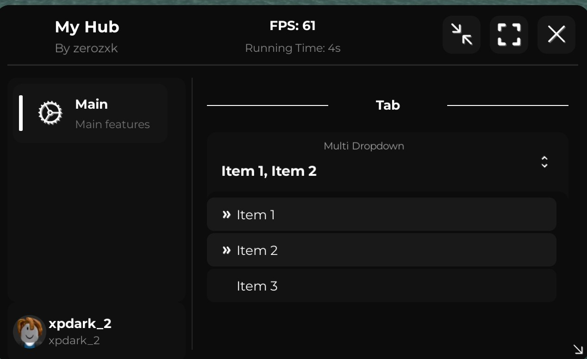
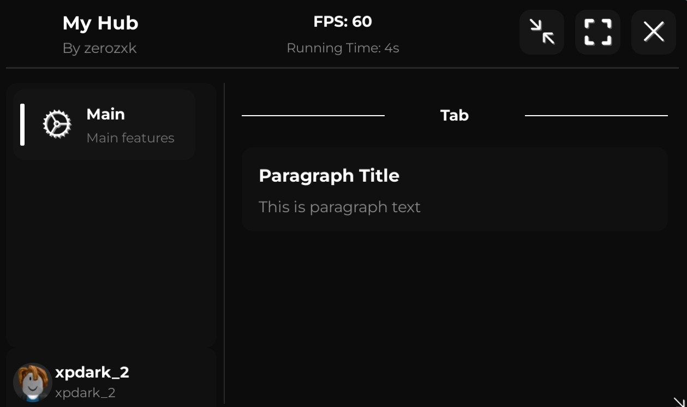
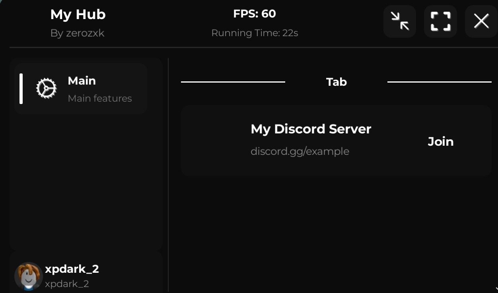

# Catlib

- https://discord.gg/cathub


- Load UI

```lua
local CatLib = loadstring(game:HttpGet("https://raw.githubusercontent.com/realcath/lab/refs/heads/main/cat/libary/catlibz"))()
```

#

- Create Window

```lua
local window = CatLib:CreateWindow({
	Title = "My Hub",
	Subtitle = "By zerozxk",
	Icon = "rbxassetid://",
	Size = UDim2.new(0, 500, 0, 300),
	FloatingButton = {
		Enabled = true,
		Icon = "rbxassetid://",
		Size = UDim2.new(0, 60, 0, 60),
		Position = UDim2.new(0, 20, 0, 100),
		Shape = "Square"
	}
})
```

#

- Create Tab

```lua
local tab = window:CreateTab({
	Name = "Main",
	Title = "Main",
	Subtitle = "Main features",
	Icon = "rbxassetid://"
})
```

#

- Create Section

```lua
tab:AddSection("Tab")
```

#

- Create Notify

```lua
window:Notify({
	Title = "Welcome!",
	Text = "CatLib loaded successfully",
	Duration = 5
})
```

#

- Create Toggle

```lua
tab:AddToggle({
	Name = "Toggle",
    Description = "My Toggle",
	Default = false,
	Callback = function(value)
	end
})
```



#

- Create ToggleConfirmation

```lua
tab:AddToggleConfirmation({
	Name = "Toggle Confirmation",
	Callback = function(value)
	end
})
```



#

- Create Button

```lua
tab:AddButton({
	Name = "Button Example",
	Callback = function()
	end
})
```



#

- Create ButtonConfirmation

```lua
tab:AddButtonConfirmation({
	Name = "Button Confirmation",
	Callback = function()
	end
})
```



#

- Create TextBox

```lua
tab:AddTextBox({
	Name = "TextBox Example",
	Placeholder = "Enter your name...",
	Default = "",
	Callback = function(text)
	end
})
```



#

- Create Slider

```lua
tab:AddSlider({
	Name = "Slider Example",
	Min = 0,
	Max = 100,
	Default = 50,
	Callback = function(value)
	end
})
```



#

- Create Dropdown

```lua
tab:AddDropdown({
	Name = "Dropdown Example",
	Options = {"Option 1", "Option 2", "Option 3"},
	Default = "Option 1",
	Callback = function(option)
	end
})
```



#

- Create MultiDropdown

```lua
tab:AddMultiDropdown({
	Name = "Multi Dropdown",
	Options = {"Item 1", "Item 2", "Item 3"},
	Default = {},
	Callback = function(options)
	end
})
```



#

- Create Paragraph

```lua
tab:AddParagraph({
	Title = "Paragraph Title",
	Text = "This is paragraph text"
})
```



#

- Create DiscordInvite

```lua
tab:AddDiscordInvite({
	Icon = "rbxassetid://",
	ServerName = "My Discord Server",
	Link = "discord.gg/example",
})
```



# Example of use

```lua
local CatLib = loadstring(game:HttpGet("https://raw.githubusercontent.com/realcath/lab/refs/heads/main/cat/libary/catlibz"))()

local window = CatLib:CreateWindow({
	Title = "My Hub",
	Subtitle = "By zerozxk",
	Icon = "rbxassetid://",
	Size = UDim2.new(0, 500, 0, 300),
	FloatingButton = {
		Enabled = true,
		Icon = "rbxassetid://",
		Size = UDim2.new(0, 60, 0, 60),
		Position = UDim2.new(0, 20, 0, 100),
		Shape = "Square"
	}
})

local tab = window:CreateTab({
	Name = "Main",
	Title = "Main",
	Subtitle = "Main features",
	Icon = "rbxassetid://"
})

tab:AddSection("Tab")

window:Notify({
	Title = "Welcome!",
	Text = "CatLib loaded successfully",
	Duration = 5
})

tab:AddToggle({
	Name = "Toggle",
    Description = "My Toggle",
	Default = false,
	Callback = function(value)
	end
})

tab:AddToggleConfirmation({
	Name = "Toggle Confirmation",
	Callback = function(value)
	end
})

tab:AddButton({
	Name = "Button Example",
	Callback = function()
	end
})

tab:AddButtonConfirmation({
	Name = "Button Confirmation",
	Callback = function()
	end
})

tab:AddTextBox({
	Name = "TextBox Example",
	Placeholder = "Enter your name...",
	Default = "",
	Callback = function(text)
	end
})

tab:AddSlider({
	Name = "Slider Example",
	Min = 0,
	Max = 100,
	Default = 50,
	Callback = function(value)
	end
})

tab:AddDropdown({
	Name = "Dropdown Example",
	Options = {"Option 1", "Option 2", "Option 3"},
	Default = "Option 1",
	Callback = function(option)
	end
})

tab:AddMultiDropdown({
	Name = "Multi Dropdown",
	Options = {"Item 1", "Item 2", "Item 3"},
	Default = {},
	Callback = function(options)
	end
})

tab:AddParagraph({
	Title = "Paragraph Title",
	Text = "This is paragraph text"
})

tab:AddDiscordInvite({
	Icon = "rbxassetid://",
	ServerName = "My Discord Server",
	Link = "discord.gg/example",
})
```
